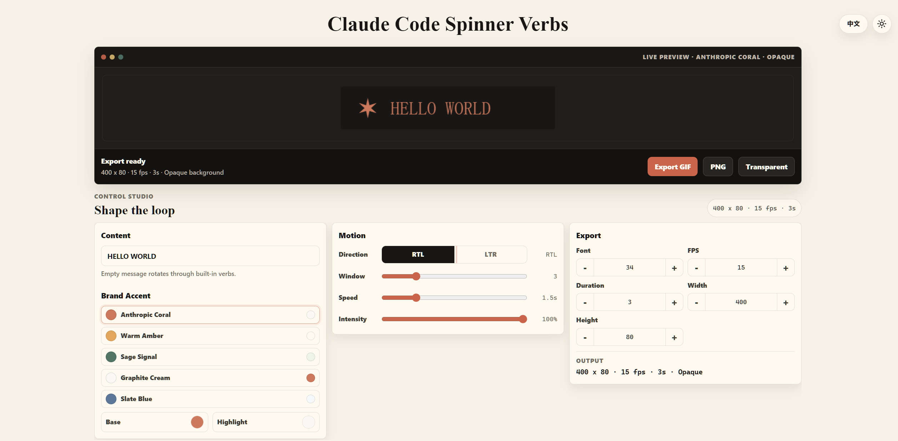

# Claude Code Spinner Verbs

Create beautiful Claude-style loading spinner animations directly in your browser.

Customize text, colors, shimmer effects, animation speed, and export high-quality **GIF** or **PNG** assets — all from a single HTML file, with no installation or build step required.

---

## ✨ Features

* Live canvas preview
* Export animated GIFs
* Adjustable shimmer animation
* Custom accent colors
* Transparent or solid background
* Single-file application (no dependencies)

---

## 📸 Screenshots

Export your spinner as an animated GIF or save the current frame as a PNG.

---

## 🚀 Usage

1. Open [Claude-Code-Spinner-Verbs](https://hiueetr.github.io/Claude-Code-Spinner-Verbs/)[hiueetr](https://hiueetr.github.io/Claude-Code-Spinner-Verbs/) in any modern browser.
2. Enter your own loading text, or leave it empty to automatically cycle through verbs.
3. Customize:
   * Accent color
   * Shimmer direction
   * Shimmer speed
   * Shimmer width
   * Animation size
   * FPS
   * Duration
4. Preview changes instantly.
5. Export as **GIF** or  **PNG** .

---

## ⚙️ Customization

You can freely configure:

* Loading message
* Accent color
* Background transparency
* Animation size
* GIF resolution
* GIF duration
* GIF frame rate
* Shimmer direction
* Shimmer intensity
* Shimmer speed
* Shimmer width

All changes are reflected immediately in the preview.

---

## 📄 License

MIT License
